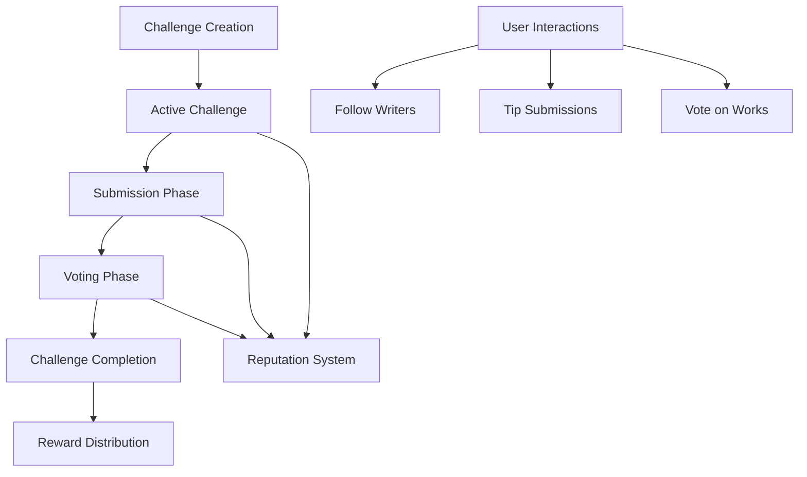

# Living Trailblazing UI: Collaborative Creative Writing Platform

## 🌟 Project Overview

Living Trailblazing UI is an innovative decentralized platform that transforms creative writing into an interactive, community-driven experience. By leveraging blockchain technology, we create a transparent, engaging ecosystem where writers can collaborate, challenge themselves, and earn rewards for their creativity.

### 🚀 Core Mission

Empower writers by providing:
- Community-driven writing challenges
- Transparent voting mechanisms
- Fair reward distribution
- Immutable creative attribution
- Genre-specific reputation tracking

## 🔧 Technical Architecture



### 💡 Key Features
- Decentralized writing challenge platform
- Smart contract-managed submissions
- Community-driven voting
- Reputation and reward systems
- Social interaction capabilities

## 🛠 Getting Started

### Prerequisites
- Clarinet CLI
- Stacks blockchain wallet
- Web3 browser extension

### Quick Start

1. Create a Challenge
```clarity
(contract-call? .trailblazing-platform create-challenge 
    "Summer Stories" 
    "Craft a compelling summer narrative" 
    "fiction" 
    u43200 
    u43200 
    u100000 
    u1000000)
```

2. Submit a Work
```clarity
(contract-call? .trailblazing-platform submit-work 
    u1 
    "Coastal Whispers" 
    0x...)
```

3. Vote on Submissions
```clarity
(contract-call? .trailblazing-platform vote-for-submission u1)
```

## 📊 Platform Economics

- Challenge Creation Fee: 1 STX
- Submission Fee: 0.1 STX
- Platform Fee: 5% of total rewards
- Reward Distribution:
  - 1st Place: 50%
  - 2nd Place: 30%
  - 3rd Place: 15%
  - Challenge Creator: 5%

## 🔒 Security Considerations

- Transparent voting mechanisms
- Immutable submission records
- Anti-spam submission limits
- Reputation-based engagement

## 🤝 Contributing

1. Fork the repository
2. Create a feature branch
3. Commit your changes
4. Push and create a pull request

## 📜 License

MIT License - Empowering creative collaboration through blockchain technology.